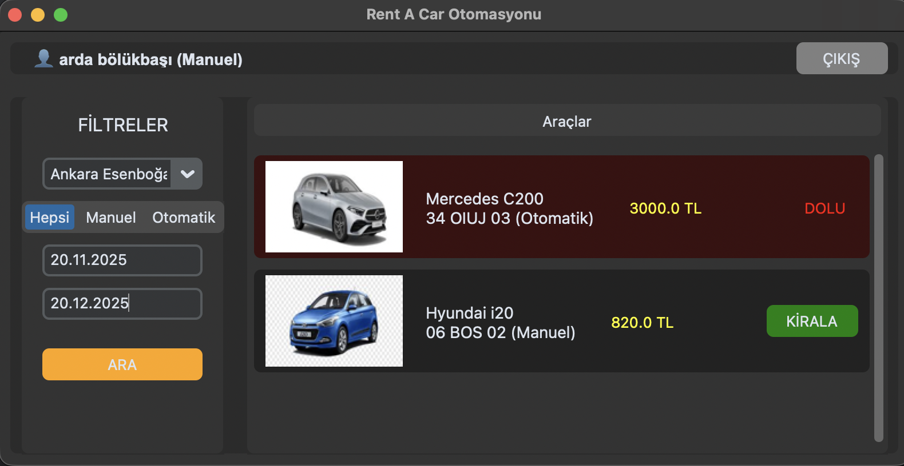

  

 

  Believing that software development isn't just learned in the classroom, I practice by developing my own projects in Python and SQL.
  I don't claim to know everything, but I have a strong passion for research and learning new technologies. Currently, I am focused on <strong>AI-integrated Web Applications</strong> and expanding my vision through Google and IBM certifications.

  🌱 Currently learning: <b>LLM Integration & Flask Architecture</b>  
  🔭 Working on: <b>AI Powered CV Analyzer</b>  
  💬 Ask me about: <b>Python, Java, SQL, Web Development</b>

  

---

<h2 align="center">🏆 Flagship Projects</h2>

<!-- Table Start -->
<table width="100%">
  <tr>
    <td width="50%" align="center" valign="top">
      <h3 align="center">
          
             
          CV Analysis & AI Matching
        </h3>
      
        
      

        Full-stack web app with <b>Python (Flask)</b> and <b>Google Gemini AI</b>. Analyzes resumes, provides ATS scores and interview questions.
      

      

        
        
        
      

       
      
      
    </td>
    <td width="50%" align="center" valign="top">
      <h3 align="center">
          
             
          PurePix - AI Image Optimizer
        </h3>
      
        
      

        Premium tool for <b>Smart Compression</b> and <b>Background Removal</b>. Built with high-performance <b>Next.js 14</b> and <b>FastAPI</b>.
      

      

        
        
        
      

       
      
      
    </td>
  </tr>
</table>

---

<h2 align="center">📂 Other Applications & Solutions</h2>

<table width="100%">
  <tr>
    <td width="50%" align="center" valign="top">
      <h3 align="center">🚗 Car Rental Automation</h3>
      
       
      <b>👆 Python Desktop App</b>
      

        Advanced desktop automation built with CustomTkinter. Features user management, vehicle tracking, and rental logic.
      

    </td>
    <td width="50%" align="center" valign="top">
      <h3 align="center">🌐 Personal Portfolio</h3>
      
       
      <b>👆 Web Development</b>
      

        Multi-language (TR/EN) portfolio site with dynamic dark mode and GitHub API integration.
      

      
    </td>
  </tr>
  
  <tr>
    <td width="50%" align="center" valign="top">
      <h3 align="center">🏗️ Edarch-Studio (No-Code)</h3>
      
       
      <b>👆 Solution Architecture</b>
      

        Corporate site strategy using No-Code tools to deliver cost-effective and maintainable solutions for clients.
      

       
    </td>
    <td width="50%" align="center" valign="top">
      <h3 align="center">📖 Interactive Portfolio</h3>
      
       
      <b>👆 Creative Front-end</b>
      

        Realistic digital flipbook built with Turn.js, demonstrating advanced JS animations.
      

      
    </td>
  </tr>
</table>

---

<h2 align="center">Tᴇᴄʜ sᴛᴀᴄᴋ & Tᴏᴏls</h2>

  
  
  
  
  
  
  
  
  

 
 

## 🐍 Contribution Activity

  <picture>
    <source media="(prefers-color-scheme: dark)" srcset="https://raw.githubusercontent.com/ArdaBolukbasi/ArdaBolukbasi/output/github-contribution-grid-snake-dark.svg?t=4000">
    <source media="(prefers-color-scheme: light)" srcset="https://raw.githubusercontent.com/ArdaBolukbasi/ArdaBolukbasi/output/github-contribution-grid-snake.svg?t=4000">
    
  </picture>

---

<h2 align="center">🤝 Cᴏɴɴᴇᴄᴛ Wɪᴛʜ Mᴇ 🤝 </h2>

  
  
  

 
